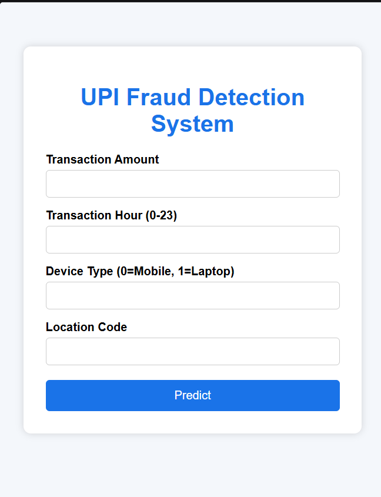
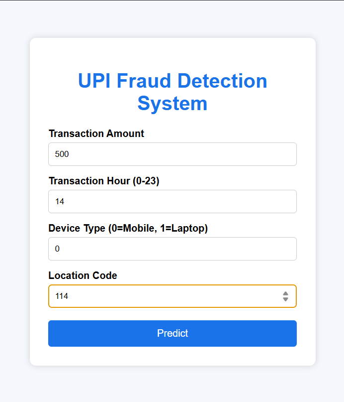

# 🚨 UPI Fraud Detection

## 📌 Overview
This project detects fraudulent UPI transactions using Machine Learning. It preprocesses transaction data, trains a model, and predicts whether a transaction is fraudulent or safe.

---

## ✨ Features
- Data preprocessing
- Fraud detection using Random Forest
- Transaction prediction
- Flask web application
- Organized project structure

---

## 🛠 Technologies Used
- Python
- Pandas
- NumPy
- Scikit-learn
- Flask
- Joblib

---

## 📂 Project Structure

```text
UPI-Fraud-Detection/
├── data/
├── models/
├── screenshots/
├── src/
├── app.py
├── requirements.txt
├── .gitignore
└── README.md
```

---

## ⚙️ How to Run

1. Install dependencies:
   
   ```bash
   pip install -r requirements.txt
   ```
   
2. Run preprocessing:

   ```bash
   python src/preprocess.py
   ```
   
3. Train the model:

   ```bash
   python src/train_model.py
   ```

4. Start the application:

   ```bash
   python app.py
   ```
   
5. Open browser:

   ```bash
   http://127.0.0.1:5000/
   ```

   ---

## 🖼️ Screenshots

### Home Page


### Prediction Page


### Result(SAFE)Page
.png)

### Result(FRAUD)Page
.png)

---

## 🔮 Future Improvements
- Real-time fraud detection
- Better machine learning models
- Interactive dashboard

## 👨‍💻 Author
Meet Jodhani 

Diploma In Computer Engineering
